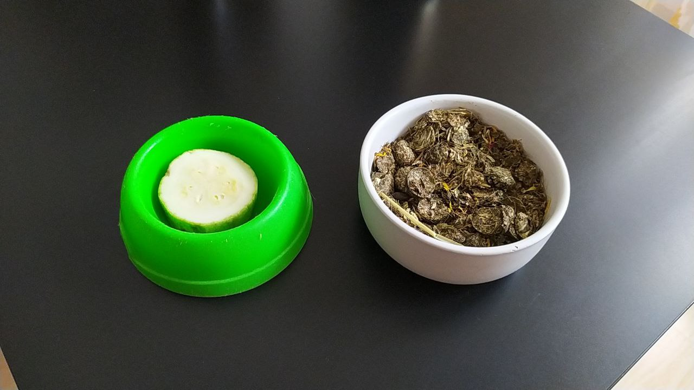

# Уход за животными

## Кормление

### Как кормить котов

**Компонентный состав**

Питание котов состоит из следующих компонентов:
* Сухой корм Purina Pro Plan Sterilized Delicate;
* Мальтпаста Cliny для вывода шерсти;
* Вода.

**Где искать корм и миски**

Кошачьи миски под корм и воду находятся под столом на кухне:
* Большие черные (2 шт.) — под воду;
* Маленькие белые (3 шт.) — под сухой корм.

Сухой корм находится в икеевском контейнере для круп на подоконнике на кухне.
Мальтпаста находится в корзинке на кухонном столе.
Вода находится в кувшине-фильтре около чайника.

**Порядок кормления**

1. Перед кормлением намажь мальтпасту на палец (из расчета на одну фалангу). Последовательно накорми 3 котов (то есть операцию надо повторить трижды). Шаг с мальтпастой опциональный, но желательный.
2. Сухой корм насыпь в белые миски доверху.
3. Вылей старую воду из черных мисок в раковину, промой губкой. Налей новую воду из фильтра. Если вода визуально чистая и в достаточном количестве (более половины миски), можно пропустить этот шаг.

### Как кормить свинок
**Компонентный состав**

Питание свинок состоит из следующих компонентов:
* Сено;
* Травяной корм Little One;
* Сочный корм: кабачки, морковь, тыква, огурцы;
* Вода.

**Где искать корм и миски**

На каждом этаже стеллажа-клетки у каждой свинки есть:
* Сенница — это металлическая решетка-клетка для сена;
* Керамическая белая мисочка — это миска под травяной корм Little One;
* Цветная (синяя/зеленая) пластиковая мисочка — это миска под сочный корм;
* Поилка — бутылочка с крышкой, установленная в держателе.

Сено и травяной корм для свинок хранятся в шкафчике под стеллажом (**примечание:** у него сломана дверца):
* Сено — в пластиковом контейнере;
* Травяной корм — в икеевском контейнере для круп.

На кухне располагаются:
* Сочный корм для свинок — в контейнере около раковины;
* Нож для нарезки сочного корма — в стеклянном держателе около раковины;
* Вода для поилок — в кувшине-фильтре.

**Порядок кормления**

1. Аккуратно открыть клетку-стеллаж. **ВНИМАНИЕ!** Важно дождаться, когда свинка уберет лапы с дверцы, иначе она может зацепиться и выпасть из клетки.
2. Наполнить сенницу — достать сено из контейнера, воткнуть в сенницу так, чтобы оно торчало во все стороны;
3. Насыпать травяной корм в керамическую миску доверху;
4. Насыпать в цветную миску для сочного корма несколько небольших слайсов сочного корма (не более 1 см. в толщину);
5. Налить воду в поилки в кухне над раковиной (опционально, по необходимости).

**Примечание:** основа питания морских свинок — сено и трава, поэтому должна быть полная сенница и травяной корм. Сочного корма давать за раз немного. Иначе свинки могут съесть все за один раз, что неправильно. Их пищеварительная система устроена так, что надо постоянно есть.

## Порядок транспортировки свинок

1. Насыпь в бело-голубую пластиковую переноску немного сена и положи немного сочного корма;
1. Перемести свинок поштучно;
3. Закрой переноску, защелкнув все крепления;
4. Возьми с собой пакет с сеном и контейнер с сочным кормом;
5. Вместе с переноской и кормом сядь в такси.

**ВНИМАНИЕ!**

Свинок нельзя держать на ветру и при температурах менее +16 градусов. Надо сразу садиться в такси.

Также в переноске нельзя разместить поилку, поэтому свинкам надо будет активно давать сочные огурцы вместо воды.
